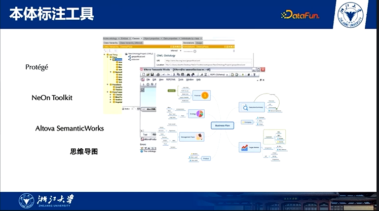
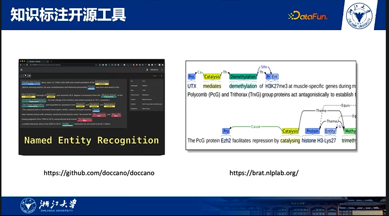
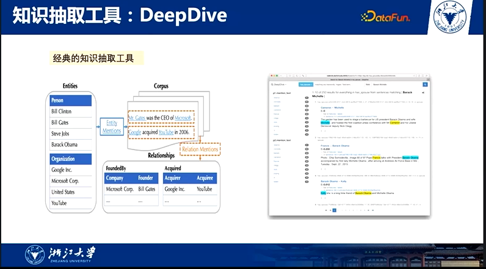
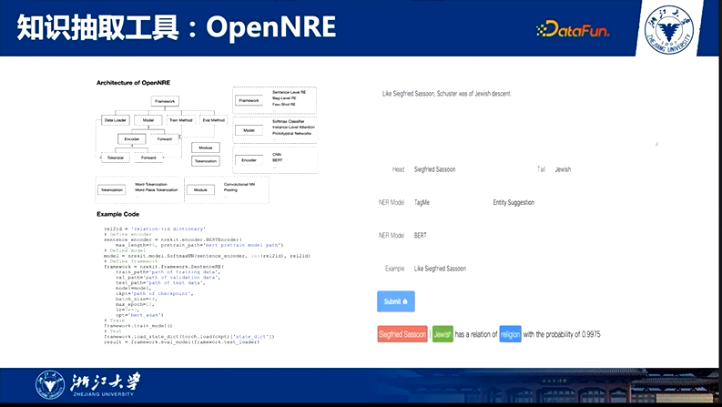
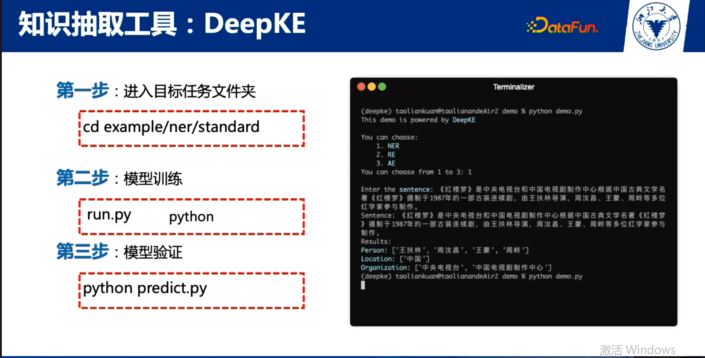

[DataFun 开源开放知识图谱论坛](https://appukvkryx45804.pc.xiaoe-tech.com/live_pc/l_622061aae4b04d7e2fd1ab50)

目前开源的知识图谱相关开源工具

医学领域主要用brat进行标注

斯坦福

清华

支持自定义、docker

[Deepke github](https://github.com/zjunlp/DeepKE)

